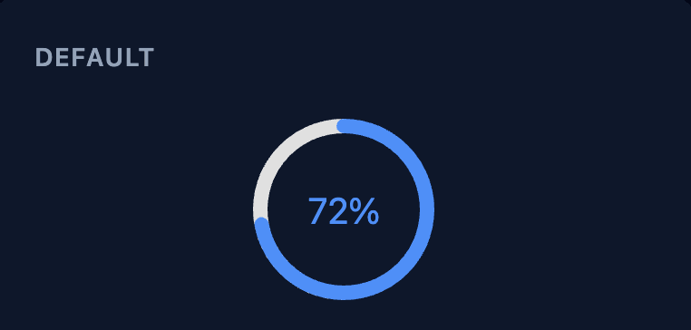
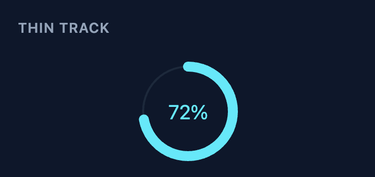
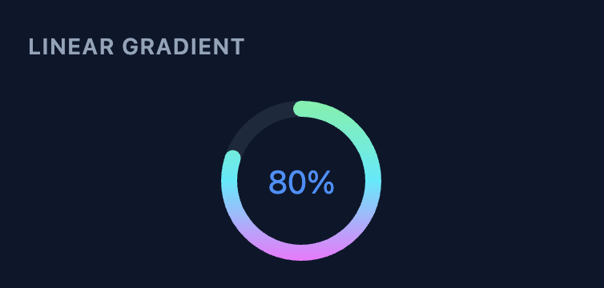
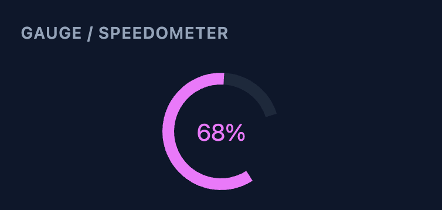
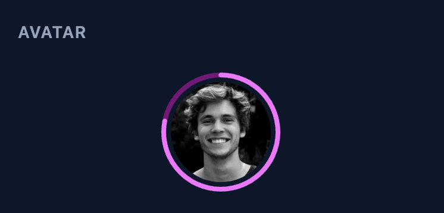
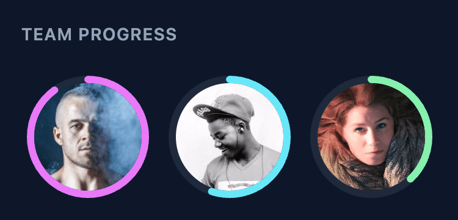

<picture>
  <source media="(prefers-color-scheme: dark)" srcset="./assets/logo-light.png">
  
</picture>

# progress-ring

[](https://www.npmjs.com/package/@deftlycreative/progress-ring)
[](https://github.com/deftlycreative/progress-ring/actions/workflows/ci.yml)
[](./LICENSE)

A lightweight, scalable circular progress bar built as a Web Component. Works in plain HTML/PHP, Vue 3, and React with a single shared implementation — no framework dependencies required.

---

## Features

- SVG-based — scales to any size without blurring
- Zero dependencies
- Works in plain HTML, PHP loops, Vue 3, and React
- Fully customizable via attributes/props
- CSS animation with configurable duration and delay
- Gauge/speedometer mode via `cut` + `rotation`
- Linear gradient arc stroke
- Avatar image inside the circle (replaces the label)
- Accessible (`role="img"` + `aria-label`)
- Shadow DOM encapsulation prevents style conflicts

---

## Preview

<table>
  <tr>
    <td align="center"><b>Default</b><br></td>
    <td align="center"><b>Thin Track</b><br></td>
    <td align="center"><b>Linear Gradient</b><br></td>
  </tr>
  <tr>
    <td align="center"><b>Gauge / Speedometer</b><br></td>
    <td align="center"><b>Avatar</b><br></td>
    <td align="center"><b>Team Progress</b><br></td>
  </tr>
</table>

---

## Installation

### CDN / Plain HTML / PHP

```html
<!-- UMD (no import, works with a plain <script> tag) -->
<script src="https://unpkg.com/@deftlycreative/progress-ring/dist/progress-ring.umd.js"></script>

<!-- ESM (use with type="module") -->
<script type="module" src="https://unpkg.com/@deftlycreative/progress-ring/dist/progress-ring.js"></script>
```

You can also use [jsDelivr](https://www.jsdelivr.com/package/npm/@deftlycreative/progress-ring):

```html
<script src="https://cdn.jsdelivr.net/npm/@deftlycreative/progress-ring/dist/progress-ring.umd.js"></script>
```

> **Note:** ES modules require an HTTP server — they will not load over `file://`. Use a local dev server or serve the file from your web root.

### npm (Vue / React)

```bash
npm install @deftlycreative/progress-ring
```

### Vue 3

```js
import ProgressRing from '@deftlycreative/progress-ring/vue';
```

### React

```js
import ProgressRing from '@deftlycreative/progress-ring/react';
```

---

## Usage

### Plain HTML / PHP

```html
<script src="https://unpkg.com/@deftlycreative/progress-ring/dist/progress-ring.umd.js"></script>

<progress-ring value="72"></progress-ring>

<!-- PHP loop -->
<?php foreach ($tasks as $task): ?>
  <progress-ring
    value="<?= $task['completed'] ?>"
    max="<?= $task['total'] ?>"
    primary-color="#4f8ef7"
  ></progress-ring>
<?php endforeach; ?>
```

### Vue 3

```vue
<script setup>
import ProgressRing from '@deftlycreative/progress-ring/vue';
</script>

<template>
  <ProgressRing
    :value="task.completed"
    :max="task.total"
    primary-color="#4f8ef7"
    :animated="true"
  />
</template>
```

### React

```jsx
import ProgressRing from '@deftlycreative/progress-ring/react';

export default function App() {
  return (
    <ProgressRing
      value={task.completed}
      max={task.total}
      primaryColor="#4f8ef7"
      animated
    />
  );
}
```

---

## Parameters

All parameters are optional. Defaults are shown below.

> In HTML/PHP use **kebab-case** attributes. In React use **camelCase** props. In Vue use either.

### Value

| HTML Attribute | React Prop | Type | Default | Description |
|---|---|---|---|---|
| `value` | `value` | number | `0` | The current progress value |
| `min` | `min` | number | `0` | The minimum value (maps to 0%) |
| `max` | `max` | number | `100` | The maximum value (maps to 100%) |

The percentage is computed internally as `(value - min) / (max - min) * 100`, clamped to 0–100. With the defaults, `value` behaves exactly like a percent.

### Colors

| HTML Attribute | React Prop | Type | Default | Description |
|---|---|---|---|---|
| `primary-color` | `primaryColor` | string | `#4f8ef7` | Arc (progress) color |
| `muted-color` | `mutedColor` | string | `#e0e0e0` | Track (background arc) color |
| `background-color` | `backgroundColor` | string | `transparent` | Background fill of the host element |

### Sizing & Layout

| HTML Attribute | React Prop | Type | Default | Description |
|---|---|---|---|---|
| `size` | `size` | number \| `"auto"` | `100` | Width and height in px. `"auto"` fills the parent container (equivalent to Bootstrap's `img-fluid`) |
| `thickness` | `thickness` | number | `8` | Stroke width of the arc in px (viewBox units) |
| `padding` | `padding` | number | `0` | Inner padding between the SVG and the host element edge in px |
| `corner-radius` | `cornerRadius` | number | `0` | Border radius of the host element in px. Most visible with a background color set |

### Animation

| HTML Attribute | React Prop | Type | Default | Description |
|---|---|---|---|---|
| `animated` | `animated` | boolean | `true` | Whether to animate the arc drawing in on mount |
| `animation-duration` | `animationDuration` | number | `600` | Duration of the draw-in animation in milliseconds |
| `animation-delay` | `animationDelay` | number | `0` | Delay before the animation starts in milliseconds. Useful for staggering multiple circles |

### Label

| HTML Attribute | React Prop | Type | Default | Description |
|---|---|---|---|---|
| `label-format` | `labelFormat` | `"percent"` \| `"fraction"` \| `"value"` \| `"none"` | `"percent"` | Controls what is displayed in the center of the circle. Use `"none"` to hide it |
| `label-color` | `labelColor` | string | *(primary color)* | Color of the center label text. Defaults to `primary-color` |
| `font-family` | `fontFamily` | string | `inherit` | Font family for the label |
| `font-size` | `fontSize` | number | `20` | Font size for the label in SVG units (scales with the component) |
| `font-weight` | `fontWeight` | number \| string | `400` | Font weight for the label. Accepts any valid value: `400`, `700`, `bold`, etc. |

**Label format examples** (`value=5`, `max=10`):

| `label-format` | Output |
|---|---|
| `percent` | `50%` |
| `fraction` | `5/10` |
| `value` | `5` |
| `none` | *(hidden)* |

### Arc Style

| HTML Attribute | React Prop | Type | Default | Description |
|---|---|---|---|---|
| `stroke-linecap` | `strokeLinecap` | `"round"` \| `"butt"` \| `"square"` | `"round"` | Shape of the arc endpoints |
| `direction` | `direction` | `"clockwise"` \| `"counter-clockwise"` | `"clockwise"` | Direction the arc fills |
| `cut` | `cut` | number | `0` | Percentage of the circumference to leave open as a gap (0–99). Pair with `rotation` to create gauge/speedometer shapes — see the [Gauge example](#gauge--speedometer-example) below |
| `rotation` | `rotation` | number | `-90` | Start angle in degrees. `-90` = top, `0` = 3 o'clock, `90` = bottom, `180` = left |
| `track-thickness` | `trackThickness` | number | *(same as `thickness`)* | Stroke width for the background track ring. Set thinner than `thickness` for a modern floating-arc look |
| `linear-gradient` | `linearGradient` | string | — | 2+ comma-separated CSS colours for a horizontal gradient arc stroke, e.g. `"#f72585,#7209b7,#4361ee"`. Falls back to `primary-color` if fewer than 2 colours are provided |

### Avatar

| HTML Attribute | React Prop | Type | Default | Description |
|---|---|---|---|---|
| `avatar` | `avatar` | string | — | URL of an image to display inside the circle. Replaces the text label. The image is clipped to a circle that fits inside the arc |
| `img-padding` | `imgPadding` | number | `0` | Gap in SVG units between the avatar image edge and the inner wall of the arc |

---

## Staggered Animation Example

```html
<?php foreach ($tasks as $i => $task): ?>
  <progress-ring
    value="<?= $task['percent'] ?>"
    animation-delay="<?= $i * 150 ?>"
  ></progress-ring>
<?php endforeach; ?>
```

---

## Gauge / Speedometer Example

Use `cut` to leave a gap at the bottom and `rotation` to position the start of the arc:

```html
<!-- 40% gap at the bottom, starting from the lower-left -->
<progress-ring
  value="68"
  cut="40"
  rotation="126"
  stroke-linecap="butt"
  thickness="10"
  primary-color="#e63946"
  muted-color="#f4a1a7"
></progress-ring>
```

With a gradient and a thin track:

```html
<progress-ring
  value="75"
  cut="35"
  rotation="112"
  thickness="12"
  track-thickness="3"
  linear-gradient="#f72585,#4361ee"
></progress-ring>
```


---

## Avatar Example

```html
<progress-ring
  value="78"
  thickness="6"
  img-padding="3"
  avatar="https://example.com/photo.jpg"
></progress-ring>
```


---

## Project Structure

```
progress-ring/
├── src/
│   ├── progress-ring.js      # Web Component — all rendering logic lives here
│   ├── ProgressRing.vue      # Vue 3 wrapper (thin prop-forwarding layer)
│   └── ProgressRing.tsx      # React wrapper (thin prop-forwarding layer)
├── examples/
│   ├── index.html               # Standalone HTML/PHP demo — open via HTTP server
│   ├── vue-demo.vue            # Vue 3 demo component
│   └── react-demo.jsx          # React demo component
├── package.json
└── README.md
```

The Vue and React wrappers contain **no rendering logic** — they forward props to the Web Component and let it handle everything. Bug fixes and new features go in `progress-ring.js` only.

---

## Running the Examples

Clone the repo and install dependencies:

```bash
git clone https://github.com/deftlycreative/progress-ring.git
cd progress-ring
npm install
```

Then start whichever demo you want:

```bash
npm run dev          # Plain HTML demo (examples/index.html)
npm run dev:vue      # Vue 3 wrapper demo
npm run dev:react    # React wrapper demo
```

Each command opens the browser automatically via Vite.

---

## Browser Support

All modern browsers (Chrome, Firefox, Safari, Edge). Web Components with Shadow DOM are supported in all evergreen browsers. No polyfills required.

---

## Additional Resources

- [Web Components — MDN](https://developer.mozilla.org/en-US/docs/Web/API/Web_components)
- [Custom Elements — MDN](https://developer.mozilla.org/en-US/docs/Web/API/CustomElementRegistry/define)
- [SVG `stroke-dasharray` / `stroke-dashoffset` — MDN](https://developer.mozilla.org/en-US/docs/Web/SVG/Attribute/stroke-dasharray)
- [Vue 3 — Web Components guide](https://vuejs.org/guide/extras/web-components)
- [React — Web Components guide](https://react.dev/reference/react-dom/components#custom-html-elements)

---

## License

MIT © 2026 — see [LICENSE](LICENSE)
